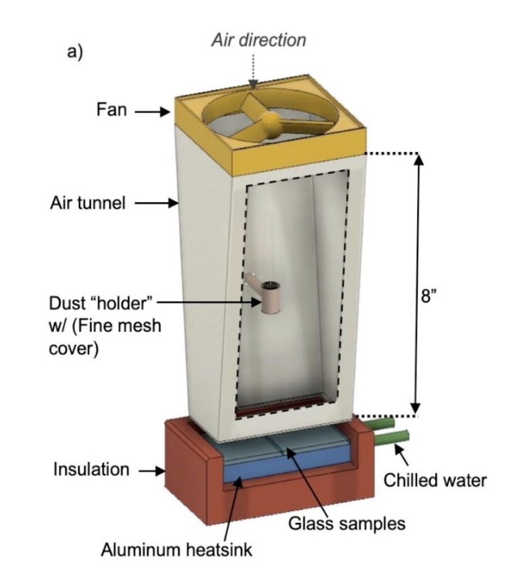
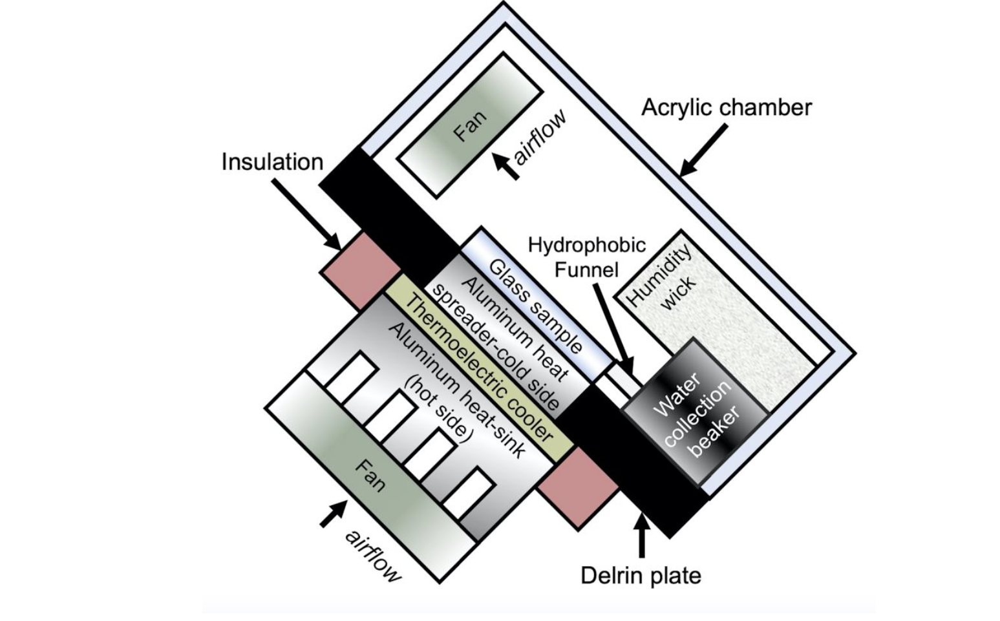

<!-- header is made with: https://github.com/kyechan99/capsule-render -->

This repo contains code for the following experimental equipment. More about the equipment can be found in my Ph.D. thesis : [Hydrophobic Fluoropolymer Nano-Coatings: Study of Anti-Reflective and Anti-Soiling Properties and Applications]('Hydrophobic Fluoropolymer Nano-Coatings.pdf').

* Pulsed Deposition Apparatus - Ref. Chapter 2.2.1
* Pulsed Deposition Apparatus v2 - Ref. Chapter 2.2.1
* Simulated Dew Condensation Chamber - Ref. Chapter 2.3

---
## Pulsed Deposition Apparatus

## Simulated Dew Condensation Chamber

## Publications

The quipment was used to publish the following papers:

1. [Self-Cleaning Hybrid Hydrophobic–Hydrophilic Surfaces: Durability and Effect of Artificial Soilant Particle Type](https://doi.org/10.1109/JPHOTOV.2019.2955559)

2. [Fluoropolymer coatings for solar cover glass: Anti-soiling mechanisms in the presence of dew](https://doi.org/10.1016/j.solmat.2019.110281)

3. [Hydrophobic–Hydrophilic Surfaces Exhibiting Dropwise Condensation for Anti-Soiling Applications](https://doi.org/10.1109/JPHOTOV.2018.2882636)

4. [Anti-reflective and anti-soiling properties of a KleanBoost™, a superhydrophobic nano-textured coating for solar glass](https://doi.org/10.1109/PVSC.2017.8366777)